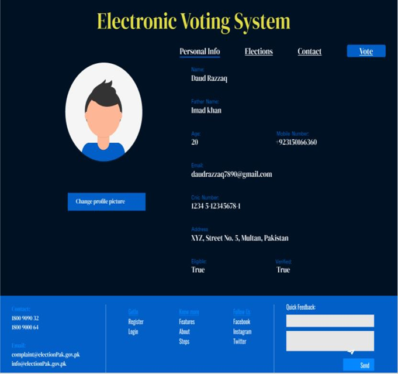
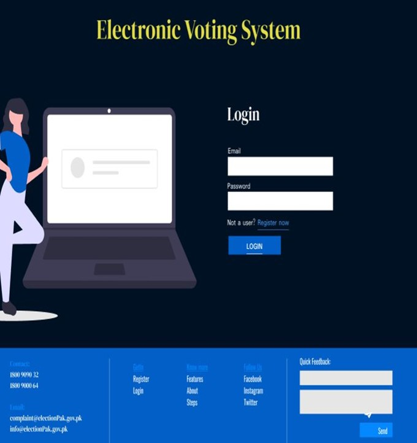
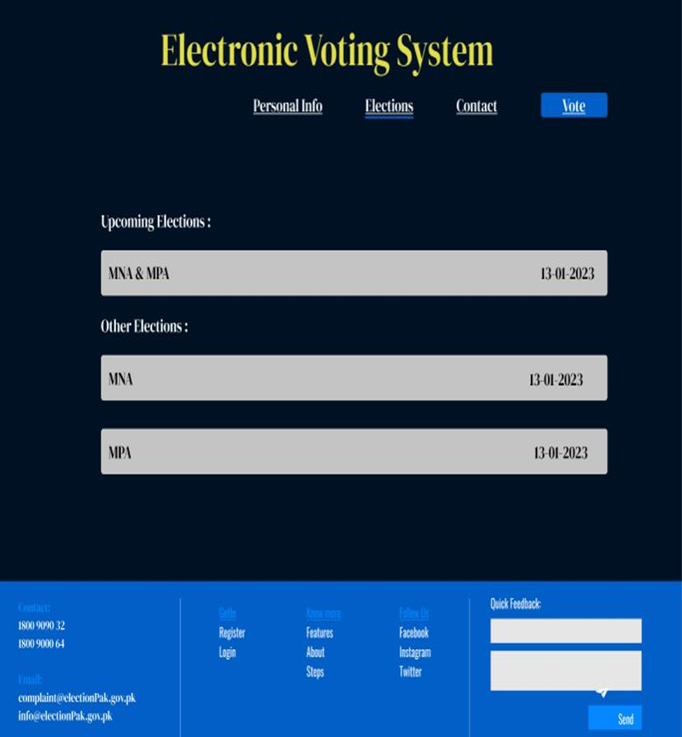

   ## 🗳️ Electronic Voting System (EVS) 

## 🌟 Introduction
The **Electronic Voting System (EVS)** is a **mobile application** designed to provide a secure, transparent, and accessible digital voting experience. 📱🛡️ It ensures fair elections by preventing fraud, enabling real-time results, and allowing voters to cast their votes from anywhere.

## 📸 Screenshots

### 🖥️ Home Page

### 🔐 Login Page

### 🗳️ Vote Casting Page

## 🚀 Features
- 👤 **User Registration**: Register with your CNIC and OTP.
- 🔐 **Secure Login**: Log in with your unique Voter ID and password.
- ✅ **Vote Casting**: Cast your vote securely for your favorite candidate.
- 📊 **Real-Time Results**: Transparent results published after voting ends.
- 👨‍💻 **Admin Panel**: Manage voters, candidates, and results with ease.
- 🎨 **User-Friendly Interface**: Simple and intuitive design for all age groups.

## 💻 Technologies Used
- 📱 **Mobile Framework**: React Native
- 🖥️ **Backend**: Python (Flask)
- 📐 **Methodology**: V-Model (SDLC)
- 🗃️ **Database**: Firebase
- 🔒 **Security**: OTP, Encryption
- 🎨 **UI Design**: Designed in Figma for a seamless experience.

## 🔍 Usage
1. **Register**: Enter your CNIC and OTP to get a Voter ID.
2. **Login**: Use your Voter ID and password to access the system.
3. **Vote**: Select your candidate and confirm your vote.
4. **View Results**: Check the results after the voting period ends.

## 🧪 Testing
The system has been rigorously tested for security and reliability. Key test cases include:
- ✅ **Registration**: Validate CNIC and OTP.
- ✅ **Login**: Secure login with Voter ID and password.
- ✅ **Vote Casting**: Ensure votes are cast correctly.
- ✅ **Results**: Accurate result publishing after voting.

## 🤝 Contributing
We welcome contributions! 🛠️
1. Fork the repo.
2. Create a new branch for your feature/bug fix.
3. Commit your changes and push the branch.
4. Submit a pull request with a detailed description.

🎨 **Figma Prototype**: [Figma Link](#)

